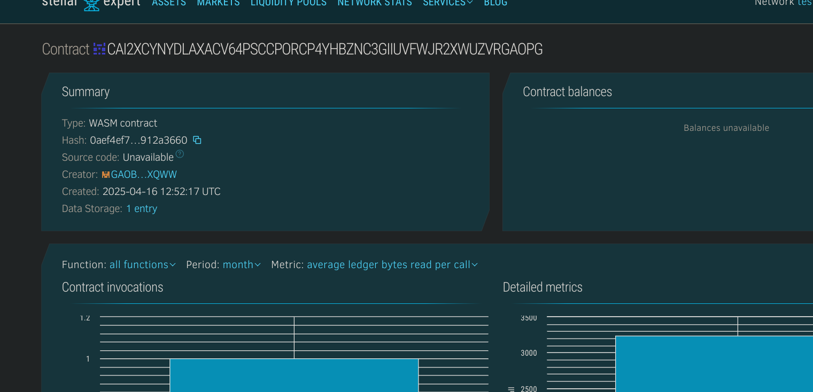

# Open Budget Tracker

## 📌 Project Title
**Open Budget Tracker**

---

## 📄 Project Description
Open Budget Tracker is a decentralized smart contract system built on the Stellar Soroban platform to help users manage and track their personal or organizational budget entries transparently. Each transaction is recorded on-chain, ensuring accountability and auditability.

---

## 🎯 Project Vision
The vision behind Open Budget Tracker is to create a transparent, verifiable, and user-owned budgeting solution that can be adopted by individuals, teams, and NGOs. By leveraging the power of blockchain, it eliminates the risk of data tampering while maintaining a user-friendly experience.

---

## 🚀 Key Features
- ➕ Add categorized income/expense entries
- 📜 Retrieve individual entry details
- 🔢 Track the total number of entries
- 🕒 Automatically timestamp each transaction for future reference
- 🔐 User-scoped entries using blockchain addresses

---

## 🔮 Future Scope
- 📊 Add budget summary reports and analytics on-chain
- 🌐 Integrate with decentralized frontends (e.g., IPFS + React)
- 🔄 Enable bulk import/export of budget entries
- 💰 Multi-user shared

## Contract Details
CAI2XCYNYDLAXACV64PSCCPORCP4YHBZNC3GIIUVFWJR2XWUZVRGAOPG
